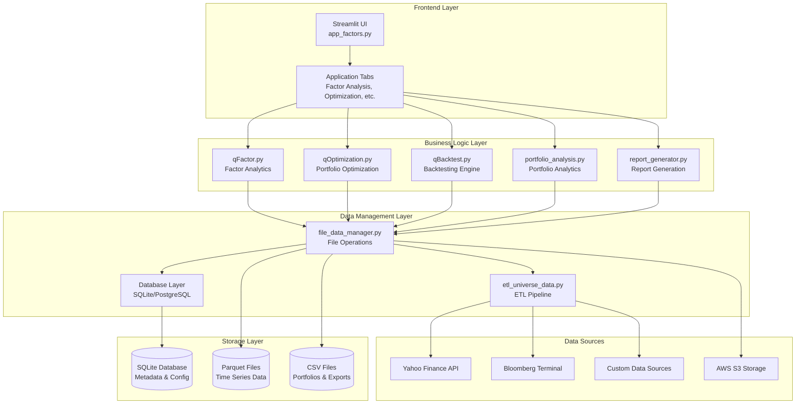
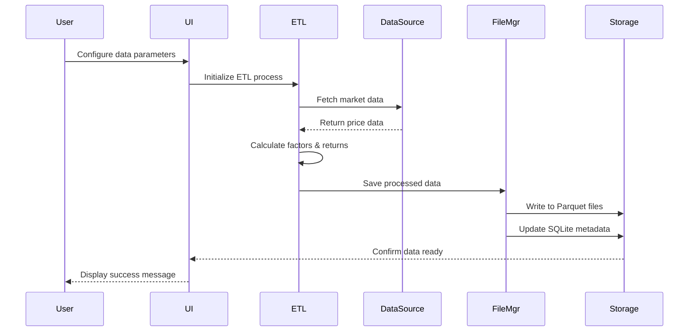
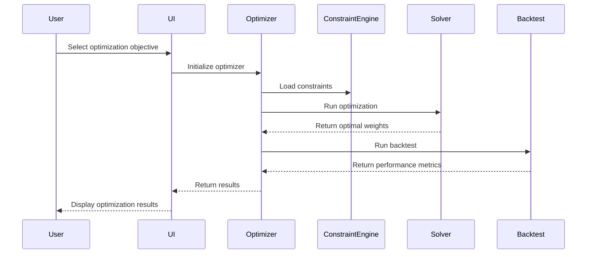
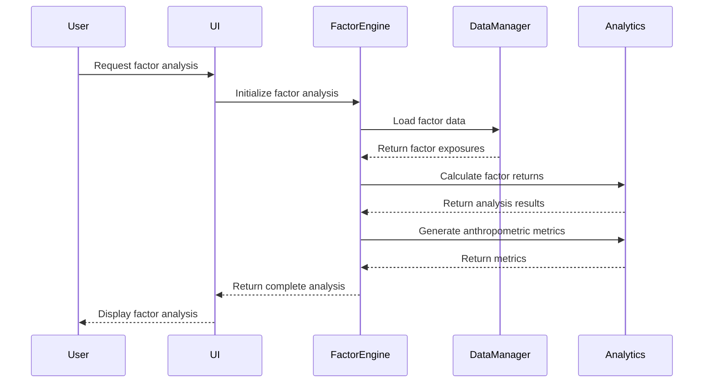

# System Architecture and Data Flow

## High-Level Architecture



## Data Flow Architecture

### 1. Data Ingestion Flow



### 2. Portfolio Optimization Flow



### 3. Factor Analysis Flow



## Component Architecture

### 1. Frontend Components

#### Streamlit Application Structure
```
app_factors.py
├── Page Configuration
├── Session State Management
├── Sidebar Configuration
│   ├── Data Management
│   ├── Universe Selection
│   ├── Factor Selection
│   └── Optimization Parameters
└── Main Tabs
    ├── Factor Analysis
    ├── Portfolio Optimization
    ├── Pure Factor Portfolios
    ├── Tracking Error Optimization
    ├── Risk Analysis
    ├── Portfolio Upload & Analysis
    ├── Report Generation
    └── Documentation
```

### 2. Business Logic Components

#### Factor Analytics (`qFactor.py`)
```
EquityFactor
├── Data Validation
├── Factor Calculation
├── Portfolio Construction
├── Performance Analysis
└── Risk Metrics

EquityFactorModelInput
├── Configuration Management
├── Parameter Validation
└── Model Setup

SecurityMasterFactory
├── Security Data Management
├── Benchmark Integration
└── Universe Handling
```

#### Optimization Engine (`qOptimization.py`)
```
PureFactorOptimizer
├── Factor Neutralization
├── Long-Short Portfolio Construction
└── Performance Optimization

TrackingErrorOptimizer
├── Benchmark Relative Optimization
├── Constraint Management
└── Risk Budgeting

OptimizationConstraints
├── Constraint Validation
├── Solver Integration
└── Result Processing
```

#### Backtesting Framework (`qBacktest.py`)
```
Backtest
├── Portfolio Simulation
├── Performance Calculation
├── Risk Metrics
└── Attribution Analysis

BacktestConfig
├── Configuration Management
├── Parameter Validation
└── Model Setup
```

### 3. Data Management Components

#### File Data Manager (`file_data_manager.py`)
```
FileDataManager
├── Data Loading
├── Data Saving
├── Format Conversion
└── Cache Management

FileConfig
├── Path Management
├── Format Configuration
└── Cache Settings
```

#### ETL Pipeline (`etl_universe_data.py`)
```
ETL Process
├── Data Extraction
├── Data Transformation
├── Data Loading
└── Quality Validation

Data Sources
├── Yahoo Finance
├── Bloomberg Terminal
├── Custom Sources
└── File Uploads
```

## Data Model Architecture

### 1. Core Data Models

#### Factor Data Model
```python
FactorData {
    date: datetime
    sid: str
    factor_name: str
    exposure_value: float
    metadata: dict
}
```

#### Portfolio Data Model
```python
PortfolioData {
    date: datetime
    sid: str
    weight: float
    metadata: dict
}
```

#### Returns Data Model
```python
ReturnsData {
 yearly    date: datetime
    sid: str
    return_value: float
    price: float
    metadata: dict
}
```

### 2. Configuration Models

#### Model Input Configuration
```python
EquityFactorModelInput {
    params: ParamsConfig
    backtest: BacktestConfig
    regime: RegimeConfig
    export: ExportConfig
}
```

#### Optimization Configuration
```python
OptimizationConfig {
    objective: str
    constraints: BaseModel
    solver_settings: dict
    performance_targets: dict
}
```

## Integration Patterns

### 1. Data Integration

#### Multi-Source Data Integration
```python
class DataIntegrationManager:
    def __init__(self):
        self.sources = {
            'yahoo': YahooDataSource(),
            'bloomberg': BloombergDataSource(),
            'custom': CustomDataSource()
        }
    
    def get_unified_data(self, universe: str, date_range: tuple):
        """Integrate data from multiple sources."""
        unified_data = {}
        for source_name, source in self.sources.items():
            data = source.fetch_data(universe, date_range)
            unified_data[source_name] = data
        return self.merge_data_sources(unified_data)
```

#### Real-time Data Updates
```python
class RealTimeDataManager:
    def __init__(self):
        self.cache = {}
        self.update_frequency = 300  # 5 minutes
    
    def get_latest_data(self, identifier: str):
        """Get latest data with caching."""
        if self.should_update(identifier):
            self.cache[identifier] = self.fetch_latest_data(identifier)
        return self.cache[identifier]
```

### 2. Optimization Integration

#### Multi-Objective Optimization
```python
class MultiObjectiveOptimizer:
    def __init__(self):
        self.objectives = {
            'pure_factor': PureFactorOptimizer(),
            'tracking_error': TrackingErrorOptimizer(),
            'risk_parity': RiskParityOptimizer()
        }
    
    def optimize(self, objective: str, data: dict):
        """Route to appropriate optimizer."""
        if objective not in self.objectives:
            raise ValueError(f"Unknown objective: {objective}")
        return self.objectives[objective].optimize(data)
```

#### Constraint Management
```python
class ConstraintManager:
    def __init__(self):
        self.constraints = {}
    
    def add_constraint(self, name: str, constraint: BaseModel):
        """Add optimization constraint."""
        self.constraints[name] = constraint
    
    def validate_constraints(self, portfolio: pd.DataFrame):
        """Validate portfolio against constraints."""
        violations = []
        for name, constraint in self.constraints.items():
            if not constraint.validate(portfolio):
                violations.append(name)
        return violations
```

### 3. Performance Monitoring

#### Performance Metrics
```python
class PerformanceMonitor:
    def __init__(self):
        self.metrics = {}
    
    def track_optimization_performance(self, optimizer: str, duration: float):
        """Track optimization performance."""
        if optimizer not in self.metrics:
            self.metrics[optimizer] = []
        self.metrics[optimizer].append(duration)
    
    def get_performance_summary(self):
        """Get performance summary."""
        summary = {}
        for optimizer, durations in self.metrics.items():
            summary[optimizer] = {
                'avg_duration': np.mean(durations),
                'max_duration': np.max(durations),
                'min_duration': np.min(durations)
            }
        return summary
```

## Scalability Considerations

### 1. Horizontal Scaling

#### Microservices Architecture
```python
class MicroserviceManager:
    def __init__(self):
        self.services = {
            'factor_analysis': FactorAnalysisService(),
            'optimization': OptimizationService(),
            'backtesting': BacktestingService()
        }
    
    def distribute_workload(self, tasks: list):
        """Distribute tasks across services."""
        for task in tasks:
            service = self.get_appropriate_service(task)
            service.process_task(task)
```

#### Load Balancing
```python
class LoadBalancer:
    def __init__(self):
        self.instances = []
    
    def route_request(self, request: dict):
        """Route request to least loaded instance."""
        instance = self.get_least_loaded_instance()
        return instance.process_request(request)
```

### 2. Vertical Scaling

#### Memory Optimization
```python
class MemoryManager:
    def __init__(self):
        self.cache_size_limit = 1024 * 1024 * 1024  # 1GB
        self.cache = {}
    
    def optimize_memory_usage(self):
        """Optimize memory usage."""
        if self.get_memory_usage() > self.cache_size_limit:
            self.evict_least_used_cache()
```

#### CPU Optimization
```python
class CPUOptimizer:
    def __init__(self):
        self.parallel_processes = 4
    
    def parallel_optimization(self, tasks: list):
        """Run optimizations in parallel."""
        with ThreadPoolExecutor(max_workers=self.parallel_processes) as executor:
            futures = [executor.submit(task) for task in tasks]
            results = [future.result() for future in futures]
        return results
```

## Security Architecture

### 1. Data Security

#### Encryption
```python
class DataEncryption:
    def __init__(self):
        self.encryption_key = self.generate_encryption_key()
    
    def encrypt_sensitive_data(self, data: str):
        """Encrypt sensitive data."""
        return self.encrypt(data, self.encryption_key)
    
    def decrypt_sensitive_data(self, encrypted_data: str):
        """Decrypt sensitive data."""
        return self.decrypt(encrypted_data, self.encryption_key)
```

#### Access Control
```python
class AccessControl:
    def __init__(self):
        self.permissions = {}
    
    def check_permission(self, user: str, resource: str):
        """Check user permissions."""
        user_permissions = self.permissions.get(user, [])
        return resource in user_permissions
```

### 2. API Security

#### Authentication
```python
class APIAuthentication:
    def __init__(self):
        self.api_keys = {}
    
    def authenticate_request(self, api_key: str):
        """Authenticate API request."""
        return api_key in self.api_keys
```

#### Rate Limiting
```python
class RateLimiter:
    def __init__(self):
        self.rate_limits = {}
    
    def check_rate_limit(self, user: str, endpoint: str):
        """Check rate limit for user and endpoint."""
        key = f"{user}:{endpoint}"
        return self.is_within_rate_limit(key)
```

This architecture provides a comprehensive foundation for understanding the system design, data flow, and integration patterns of the Equity Factor Analysis Platform. The modular design ensures scalability, maintainability, and extensibility while providing robust performance and security features.
